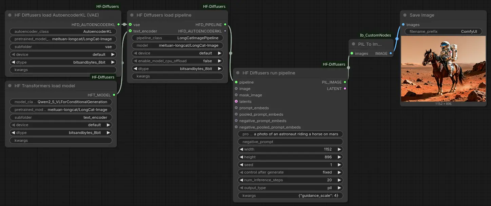

# HuggingFace Diffusers for ComfyUI

A lot of custom nodes for ComfyUI are really just bindings to HuggingFace
Diffusers, but overly constrained to use them in very particular ways. This set
of custom nodes is intended to be a generic set of bindings for HuggingFace
Diffusers, in theory allowing you to use any pipeline supported by HuggingFace.

It also supports bitsandbytes quantization, automatic device mapping, and the
other advantages unique to HuggingFace.

Because HuggingFace pipelines output PIL images, you'll likely need a node to
get PIL images into ComfyUI's format. That node isn't provided by this package;
I recommend
[ComfyUI_Ib_CustomNodes](https://github.com/Chaoses-Ib/ComfyUI_Ib_CustomNodes/).

## Philosophy

I've tried to make everything work fairly generically, as unopinionated as I
can manage.

Every node that loads a component has some default class that it loads, but you
can replace the class simply by its name. For instance, the pipeline loader
loads `AutoPipelineForText2Image` by default, but you can simply replace
`AutoPipelineForText2Image` with, e.g., `LongCatImagePipeline` to load LongCat
Image instead.

All of the nodes include a generic `kwargs` parameter, which simply takes text.
Rather than trying to anticipate every possible parameter, I've included only
the most obvious parameters, and for anything else, use `kwargs`. `kwargs` can
be empty (for no extra args) or an object in JSON format. Of course, this is
only sufficient for those arguments that take JSON-compatible values. `kwargs`
overrides other parameters.

As in HuggingFace, Pipelines are self-loading and include all components, but
you can override the VAE and text encoder components if you wish, so they're
optional inputs. If you want to load *without* these components, use `kwargs` to
set them to `null` (`None`).

## Workflows

These are some example workflows, in simple and exploded forms (where by
“exploded” I mean “each step done separately”).

[LongCat Image](workflows/hf_longcat_image.json) ([exploded](workflows/hf_longcat_image_exploded.json))

[SDXL](workflows/hf_sdxl.json) ([exploded](workflows/hf_sdxl_exploded.json))

## Nodes

Only the “load pipeline” and “run pipeline” nodes are needed for many use
cases. Plus “load LoRA” to load LoRAs. Other nodes are provided for low-level
control.

### HF Diffusers load pipeline

Loads a HuggingFace Diffusers pipeline. By default, loads
`AutoPipelineForText2Image`. Obviously, if the pipeline is supported by
`AutoPipelineForText2Image`, this is the right choice, but any other Diffusers
class can be specified.

The device and dtype can be set, and the model can be set to automatically
offload to the CPU (`enable_model_cpu_offload`). Quantization is in `dtype`.

The VAE and text encoder can optionally be overridden, and whether overridden
or not, the VAE is exported.

### HF Diffusers load LoRA

Loads a HuggingFace Diffusers LoRA onto a pipeline. Note that the original,
un-LoRA'd pipeline *cannot* be used by simply connecting the original “load
pipeline” node. The non-LoRA version is lost.

### HF Diffusers run pipeline

Runs a HuggingFace Diffusers pipeline.

For image-to-image and inpainting pipelines, supports (optional) image and mask
inputs.

The most common/necessary parameters (prompts and image size) are supported
directly. Other arguments can be provided by `kwargs`. If `num_inference_steps`
is set to 0, the default number of steps for the pipeline is used.

Supports outputting latents or PIL images, but not both at the same time (i.e.,
only one of the two outputs will be activated, based on which you chose).

## HF Diffusers load AutoencoderKL (VAE)

Loads a VAE directly. Generally speaking, the pipeline loads its own VAE, but
you can use this to use a custom VAE, or to, e.g., load the VAE on a different
device than the rest of the pipeline.

## HF Transformers load model

Load a HuggingFace *Transformers* (not Diffusers) model. Generally for the text
encoder. The pipeline loads its own text encoder, but you can use this to use a
custom encoder or load it on a different device, etc.

## HF Diffusers encode prompt

Use a HuggingFace Diffusers pipeline to encode a prompt into `prompt_embeds`.

Unfortunately, the way that `encode_prompt` works varies from pipeline to
pipeline. So, I simply provide four tensors as output, and you need to know how
the pipeline works to know which you need and where.

Some examples:

 * SDXL: `(prompt_embeds, negative_prompt_embeds, pooled_prompt_embeds, pooled_negative_prompt_embeds)`
 * Flux: `(prompt_embeds, pooled_prompt_embeds, _)`
 * Z Image: `(prompt_embeds, negative_prompt_embeds)`
 * LongCat Image: `(prompt_embeds, _)` (but the pipeline doesn't support `prompt_embeds`)

## HF Diffusers VAE decode/encode

Use these to decode/encode HuggingFace latents using HuggingFace VAEs.
Automatic if pipelines are run in PIL mode.
